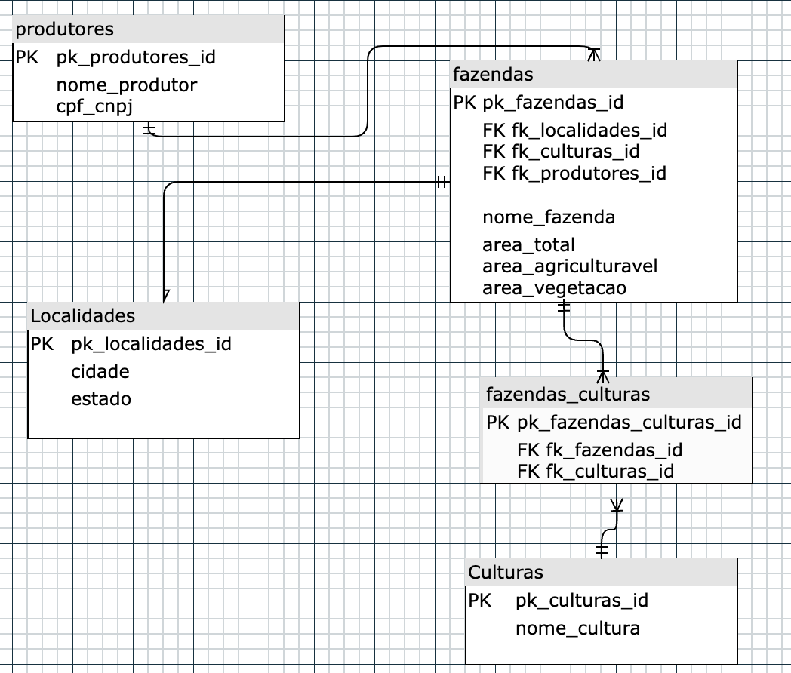

## Agricultura

### Modelagem relacional do Banco de Dados



### Como executá-lo?

```
docker-compose up
```

A API será exposta na porta 3001 e o banco poderá ser acesso pela 5432 com as credenciais correspondestes no arquivo Docker.
